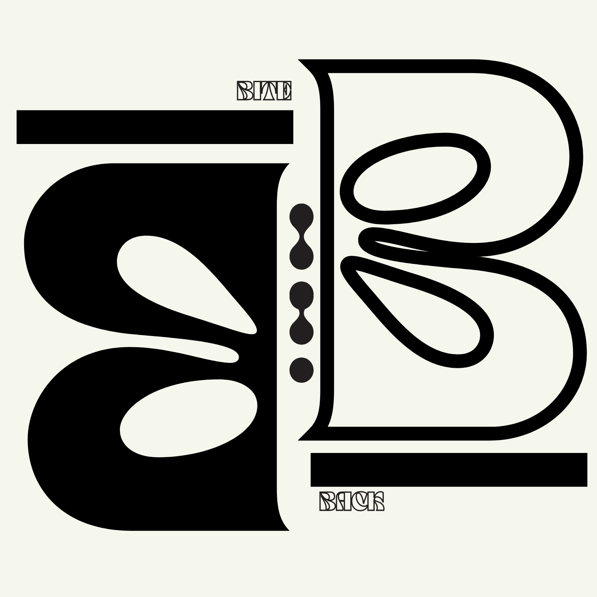
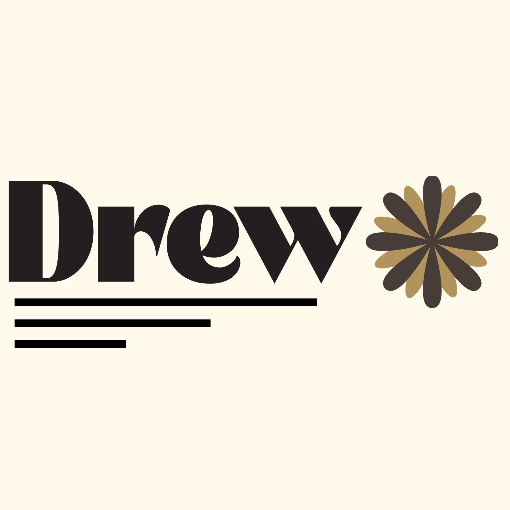

# Team Drew - Project BiteBack

Welcome to our project!

The BiteBack logo features two letters “B” mirrored to each other, creating a sort of symmetrically abstract butterfly-esque shape.  
The choice of the colours black and khaki shows the contrast on the two main letters. The contrast of hollowness and the fullness of the two letters also shows a sort of yin and yang to the logo.  
The logo employs minimalism, as the main purpose of the application is avoiding overconsumption and waste; the logo shows a balance and restraint.

The Drew logo is specifically inspired by Bauhaus design, employing geometrical and linear design
The logo is named after my second name, which is Andrew. The linear lines show structure, while the shape on the side shows contrast of different geometrical shapes
The logo utilizes Gestalt's law of continuity, shown by even different components being connected to make a harmonious and minimalistic design

